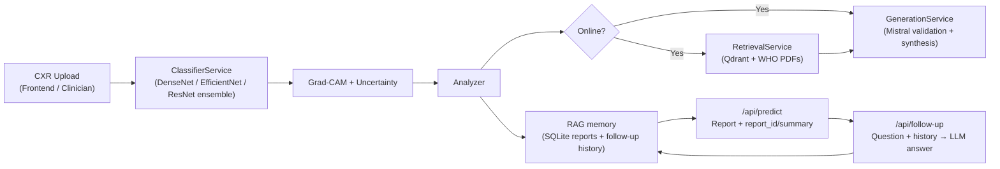

# 🫁 TB-Vision

### Explainable AI for Tuberculosis Screening in Resource-Limited Settings

TB-Vision is a **clinical decision support system for tuberculosis screening** that combines lightweight deep learning models with explainable AI and intelligent validation. 
The system is designed for **rural clinics and low-resource healthcare environments**, where radiologists and diagnostic infrastructure are limited.

1️⃣ **Local CNN ensemble** analyzes chest X-rays  
2️⃣ **Uncertainty estimation** determines prediction confidence  
3️⃣ **Cloud validation** is triggered for further medical explaination 

This hybrid design enables **fast, affordable, and scalable TB screening worldwide.**

---

### 🔗 Links

| Resource | Link |
|--------|------|
| Demo Video | https://youtu.be/... |

---

### 🧠 Core Idea

Most AI systems for medical imaging suffer from:

- black-box predictions
- overconfident outputs
- lack of clinical context
- dependence on cloud infrastructure

TB-Vision solves these problems through:

- **Explainable AI (Grad-CAM++)**
- **Uncertainty-aware predictions**
- **Offline-first deployment**
- **Multi-stage AI validation**

# 🚨 The Problem

Tuberculosis remains one of the deadliest infectious diseases worldwide.

### Global Impact
- **10.7 million cases** reported in 2024
- **1.23 million deaths annually**
- **2.4 million cases remain undiagnosed**

### Healthcare Inequality

Many countries with the highest TB burden lack access to diagnostic radiology.

| Region | Radiologists per million |
|------|------|
| USA / Europe | 100+ |
| Indonesia | <10 |
| Pakistan | <8 |
| Low-income regions | <2 |

Over **50% of the world's population lacks reliable diagnostic imaging access.**

### Why Current AI Solutions Fail

Existing AI tools often fail in real clinical environments because they:

- act as **black boxes**
- produce **overconfident predictions**
- require **constant internet connectivity**
- are **too expensive for mass screening**

This creates a critical need for an **affordable, explainable, and offline-capable TB screening system.**

# 💡 Our Solution

TB-Vision introduces a **hybrid AI screening system** that combines:

- lightweight deep learning models
- explainable AI
- uncertainty-aware predictions
- optional cloud validation

### Key Principles

**Offline First**

The core CNN ensemble runs locally on basic computers without internet access.

**Explainability**

Grad-CAM++ highlights the lung regions influencing the AI decision.

**Uncertainty Awareness**

Monte-Carlo Dropout estimates prediction confidence and flags risky cases.

**Intelligent Escalation**

Only uncertain cases are forwarded to advanced AI models for deeper analysis.

---

### Screening Workflow

1️⃣ Patient X-ray uploaded  
2️⃣ CNN ensemble performs local prediction  
3️⃣ Uncertainty score calculated  
4️⃣ High-confidence cases resolved locally  
5️⃣ Uncertain cases escalated for AI validation  

# 🏗 System Architecture

TB-Vision follows a **multi-stage AI pipeline**.

### Stage 1 — Local CNN Ensemble
Models used:

- DenseNet121
- EfficientNet-B3
- ResNet50

The ensemble improves robustness and reduces model bias.

Outputs:

- TB probability
- prediction uncertainty
- Grad-CAM heatmap

---

### Stage 2 — Uncertainty Estimation

Monte-Carlo Dropout performs multiple forward passes to measure prediction confidence.

This helps detect cases where the model may be unsure.

---

### Stage 3 — Intelligent AI Validation

When uncertainty is high, the system can optionally use cloud AI models to validate findings and generate clinical explanations.

This ensures **safety without requiring constant internet connectivity.**
